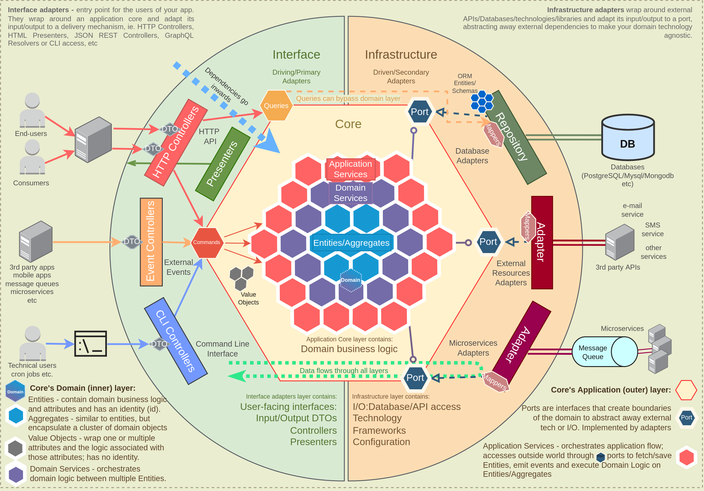
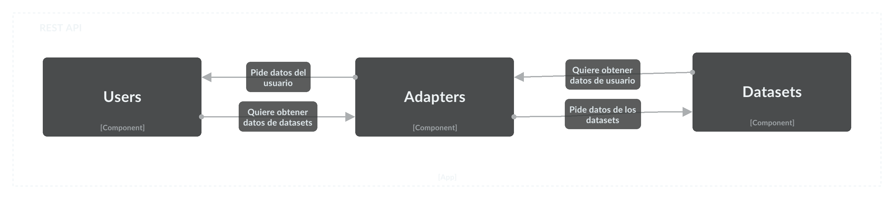

<h1 align="center">Template para proyectos con express y arquitectura hexagonal</h1>

## Tabla de contenidos.

- [Arquitectura hexagonal](#arquitectura-hexagonal)
- [Commit linting](#commit-linting)
- [Installing](#installing)
- [Building](#building)
- [Testing](#testing)
- [Linting](#linting)

## Arquitectura hexagonal

<a name="arquitectura-hexagonal"></a>

La arquitectura hexagonal es un estilo de arquitectura de software que permite crear aplicaciones con un bajo acoplamiento entre sus componentes y que son fáciles de testear.
Para aprovechar estas ventajas es necesario que los componentes de la aplicación estén bien definidos y que se respeten las reglas que propone esta arquitectura.

### Verticales de la arquitectura hexagonal

En este repositorio estamos utilizando la arquitectura hexagonal con 3 verticales:

- **Usuarios:** Se encarga de gestionar los usuarios de la aplicación.
- **Datasets:** Se encarga de gestionar los datasets de la aplicación.
- **Health:** Se encarga de gestionar los endpoints de health de la aplicación.
- **Adapters:** Gestiona la comunicación entre los componentes de la aplicación de las diferentes verticales.

Para vos utilizar esta arquitectura en tu proyecto, deberías crear una vertical por cada componente de tu aplicación. Ten en cuenta
que este repositorio está pensado para aplicaciones monolíticas y no para micro-servicios. Si quieres utilizar esta arquitectura para
micro-servicios, deberías crear un repositorio por cada micro-servicio y utilizar este repositorio como témplate para cada uno de ellos.
En un ideal tendrías una vertical dispuesta en cada microservicio.

Cada una de estas verticales dentro contiene componentes de la arquitectura hexagonal.

### Componentes de la arquitectura hexagonal

- **Application**: En nuestro caso contiene un Manager, que es el componente que se encarga de gestionar las peticiones que recibe la aplicación. El Manager se comunica con el componente Domain para resolver las peticiones que recibe.
- **Domain**: Contiene elementos de dominio de la aplicación como los modelos puros de la aplicación, eventos de dominio,
  interfaces de repositorios, etc. Aquí dentro existe el directorio ports que contiene los puertos de la vertical sobre la cual estamos trabajando.
  Estos puertos son los que luego implementará cada adaptador para comunicarse con el componente de la vertical que desee.
- **Infrastructure**: Aquí ubicamos repositorios que implementan las interfaces definidas en el dominio, los controladores REST que
  decidamos utilizar, etc.



### ¿Cómo comunico las verticales entre sí?

Esta comunicación se realiza a través de los adaptadores. Los adaptadores son los encargados de comunicar las verticales entre sí.
Para ello, cada vertical tiene un adaptador que implementa los puertos de la vertical que desee comunicar con otra vertical.

Veamos el siguiente ejemplo:



En este ejemplo, la vertical de usuarios se comunica con la vertical de datasets a través de un adaptador. Este adaptador implementa
el puerto de la vertical de usuarios que se comunica con la vertical de datasets.

1. Creemos entonces un port en adapters/domain/ports para definir nuestra API expuesta por la vertical de usuarios.

   ```typescript
   export interface IUserPort {
     getById(id: string): Promise<User | null>;
   }
   ```

2. Ahora creemos un adaptador en adapters/ para implementar el puerto que acabamos de crear.

   ```typescript
   export class UsersAdapter implements IUserPort {
     constructor(private userManager: IUserManager) {}

     async getById(id: string): Promise<User | null> {
       return this.userManager.getById(id);
     }
   }
   ```

3. Ahora que tenemos nuestro adaptador, podemos utilizarlo en la vertical de datasets para comunicarnos con la vertical de usuarios.

   ```typescript
   export class DatasetsManager implements IDatasetsManager {
     constructor(private readonly usersAdapter: IUserPort, private readonly logger: ILogger) {}

     async getByUserId(userId: string): Promise<null> {
       const datasetUser = await this.usersAdapter.getById(userId);

       this.logger.info(JSON.stringify(datasetUser));
       return null;
     }
   }
   ```

El repositorio cuenta con una herramienta (dependency cruiser) para controlar los cambios y si respetan los lineamientos de la arquitectura hexagonal.
Para utilizar esta herramienta, ejecuta el siguiente comando:

```bash
npm run validate-dependencies
```

Si no hemos violado ninguna dependencia, el comando anterior no mostrará ningún error. En caso contrario, nos mostrará un error indicando
donde esta la violación.

## Commit linting

<a name="commit-linting"></a>

Para realizar el commit linting, utilizamos la herramienta [commitlint](https://commitlint.js.org/#/). Esta herramienta nos permite validar los mensajes de los commits
para que cumplan con un formato determinado.

### Formato de los mensajes de los commits

Los mensajes de los commits deben cumplir con el siguiente formato:

```text
<tipo>(<scope>): <mensaje>
```

Donde:

- **tipo**: Es el tipo de commit que se está realizando. Puede ser uno de los siguientes:

  - **build**: Cambios que afectan al sistema de build o dependencias externas (ej: npm, make, gradle, etc).
  - **ci**: Cambios en la configuración de CI (ej: Travis, Circle, BrowserStack, SauceLabs, etc).
  - **docs**: Cambios en la documentación.
  - **feat**: Añadir una nueva funcionalidad.
  - **fix**: Corregir un bug.
  - **perf**: Cambios que mejoran el rendimiento.
  - **refactor**: Cambios en el código que no corrigen un bug ni añaden una funcionalidad.
  - **style**: Cambios que no afectan al significado del código (espacios en blanco, formato, punto y coma, etc).
  - **test**: Añadir tests faltantes o corregir tests existentes.

- **scope**: Es el alcance del commit. Puede ser uno de los siguientes:

  - **app**: Cambios en la aplicación.
  - **domain**: Cambios en el dominio.
  - **adapters**: Cambios en los adaptadores.
  - **shared**: Cambios en el código compartido.
  - **config**: Cambios en la configuración.
  - **docker**: Cambios en la configuración de docker.
  - **scripts**: Cambios en los scripts.
  - **verticals**: Cambios en las verticales.
  - **infra**: Cambios en la infraestructura.
  - **test**: Cambios en los tests.
  - **docs**: Cambios en la documentación.
  - **all**: Cambios en todos los componentes.
  - **other**: Cambios en otros componentes.
  - **none**: No se especifica el alcance del commit.

- **mensaje**: Es el mensaje del commit. Debe ser una frase corta y concisa que describa el cambio que se está realizando.

Por ejemplo:

```text
feat(app): add new endpoint to get user by id
```

Todas estas validaciones se realizan automáticamente al realizar un commit. Si el commit no cumple con el formato, el commit fallará.

## Instala el proyecto

<a name="installing"></a>

```bash
nvm install 18.0.0
nvm use
npm install npm@8.3.0 -g
npm install
```

## Realiza el build

<a name="building"></a>

```bash
npm run build
```

### Builds con docker

Realiza el build de la imagen de docker con el siguiente comando.

```bash
docker build -t express-hexagonal -f docker/Dockerfile .
```

## Testing

<a name="testing"></a>

### Testing con JEST

```bash
npm run test
```

## Linting

<a name="linting"></a>

Run the linter

```bash
npm run lint
```

Fix lint issues automatically

```bash
npm run lint:fix
```
